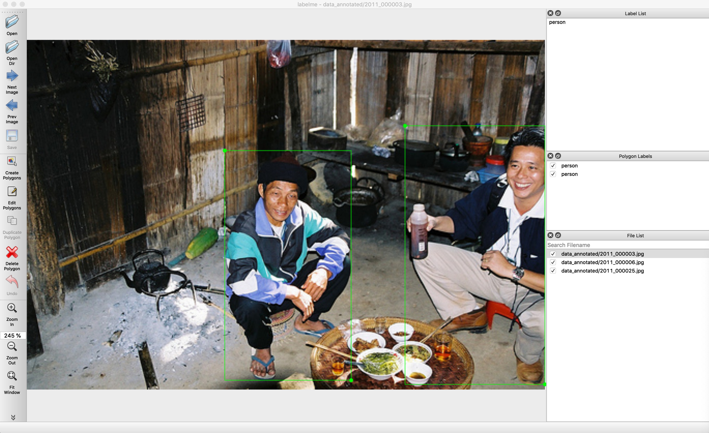

<h4 align="center">
  Image Polygonal Annotation with Python
</h4>

<br/>

<div align="center">
  
</div>

## Description

Labelme is a graphical image annotation tool inspired by <http://labelme.csail.mit.edu>.  
It is written in Python and uses Qt for its graphical interface.

      
<i>VOC dataset example of instance segmentation.</i>

    
<i>Other examples (semantic segmentation, bbox detection, and classification).</i>

### Ubuntu

```bash
sudo apt-get install labelme

# or
sudo pip3 install labelme

# or install standalone executable from:
# https://github.com/wkentaro/labelme/releases
```
### Windows

Install [Anaconda](https://www.continuum.io/downloads), then in an Anaconda Prompt run:

```bash
conda create --name=labelme python=3
conda activate labelme
pip install labelme

# or install standalone executable/app from:
# https://github.com/wkentaro/labelme/releases
```


## Usage

```bash
labelme  # just open gui

# tutorial (single image example)
cd examples/tutorial
labelme apc2016_obj3.jpg  # specify image file
labelme apc2016_obj3.jpg -O apc2016_obj3.json  # close window after the save
labelme apc2016_obj3.jpg --nodata  # not include image data but relative image path in JSON file
labelme apc2016_obj3.jpg \
  --labels highland_6539_self_stick_notes,mead_index_cards,kong_air_dog_squeakair_tennis_ball  # specify label list

# semantic segmentation example
cd examples/semantic_segmentation
labelme data_annotated/  # Open directory to annotate all images in it
labelme data_annotated/ --labels labels.txt  # specify label list with a file
```

## Developing

```bash
git clone https://github.com/wkentaro/labelme.git
cd labelme

# Install anaconda3 and labelme
curl -L https://github.com/wkentaro/dotfiles/raw/main/local/bin/install_anaconda3.sh | bash -s .
source .anaconda3/bin/activate
pip install -e .
```


## How to build standalone executable

Below shows how to build the standalone executable on macOS, Linux and Windows.  

```bash
# Setup conda
conda create --name labelme python=3.9
conda activate labelme

# Build the standalone executable
pip install .
pip install 'matplotlib<3.3'
pip install pyinstaller
pyinstaller labelme.spec
dist/labelme --version
```

## How to contribute

Make sure below test passes on your environment.  
See `.github/workflows/ci.yml` for more detail.

```bash
pip install -r requirements-dev.txt

flake8 .
black --line-length 79 --check labelme/
MPLBACKEND='agg' pytest -vsx tests/
```
